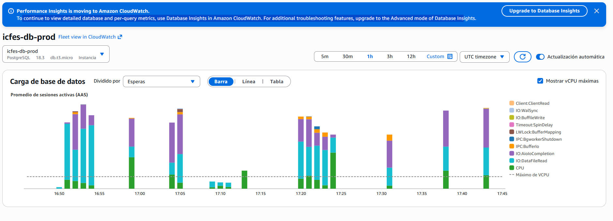
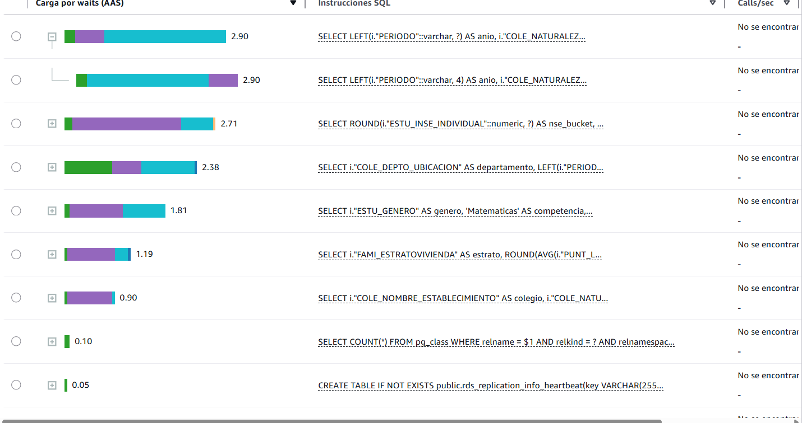
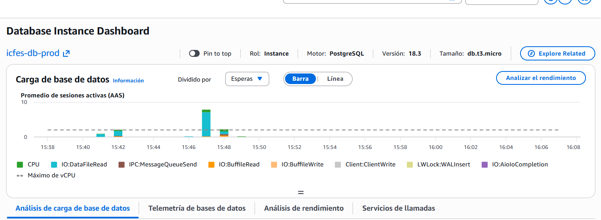
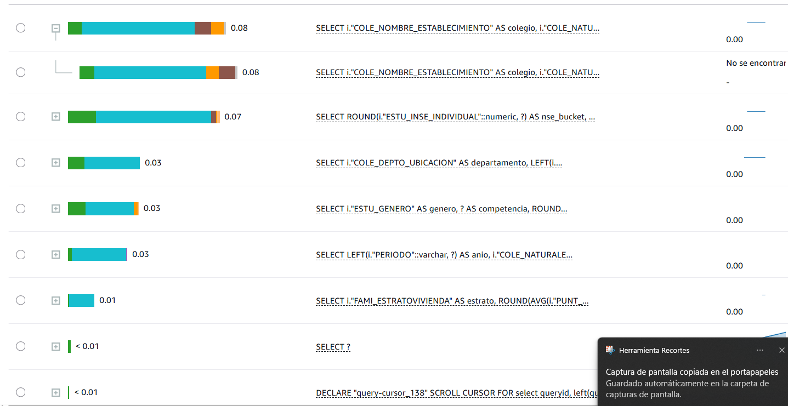

# Dashboard ICFES - Resultados Saber 11

Dashboard interactivo de visualización de datos del examen Saber 11 del ICFES Colombia (2018-2021).

## Dataset

- **Fuente**: ICFES - Instituto Colombiano para la Evaluación de la Educación
- **URL**: https://www.icfes.gov.co/resultados-saber11
- **Descripción**: Datos de rendimiento académico de estudiantes que presentaron el examen Saber 11 en Colombia durante los años 2018, 2019, 2020 y 2021. Incluye información por departamento, tipo de institución (oficial/no oficial), género, estrato socioeconómico y puntajes por competencia.

## Hallazgos Principales

1. **Brecha territorial significativa**: Los departamentos de la región Andina (Bogotá, Cundinamarca, Antioquia) superan consistentemente a los departamentos边疆 en puntaje global.
2. **Impacto del COVID-19 en 2020**: Se observa una caída en los puntajes promedio durante el año 2020 debido a la transición a educación virtual.
3. **Desigualdad por estrato**: Los estudiantes de estratos altos (5-6) superan significativamente a los de estratos bajos (1-2) en todas las competencias.
4. **Diferencia entre tipos de institución**: Los colegios no oficiales mantienen una ventaja constante sobre los colegios oficiales en todos los años.
5. **Brecha de género**: Las mujeres rinden mejor en Lectura Crítica y Sociales; los hombres en Matemáticas.

## Visualizaciones Implementadas

1. **Mapa de Calor Territorial**: Coropleth map mostrando el puntaje global promedio por departamento.
2. **La Desigualdad Competencia a Competencia**: Heatmap de puntajes por estrato y competencia.
3. **La Brecha que No Cierra: Oficiales vs. Privados**: Serie temporal comparando colegios oficiales vs. no oficiales.
4. **¿Quién Puntúa Más? Distribución por Género**: Boxplot de distribución de puntajes por género y competencia.
5. **Capital Social vs. Capital Académico**: Bubble chart correlacionando nivel socioeconómico con puntaje.
6. **Top 20 Colegios con Mayor Puntaje**: Ranking de los mejores colegios.

## Optimización de Rendimiento

### Problema Inicial

Las consultas SQL eram extremadamente lentas (~30+ segundos por request), causando timeouts en AWS Aurora y una mala experiencia de usuario.

**Board AWS antes de optimización (v1 sin optimizar):**



**Tiempos de consultas repetitivas antes:**



### Solución Implementada

Se implementaron varias optimizaciones:

1. **Caching en memoria** (node-cache): TTL de 5 minutos para queries sin filtros
2. **Índices PostgreSQL**: Créate en columnas usadas en WHERE y GROUP BY
3. **Vistas Materializadas**: Pre-calcular agregaciones comunes
4. **Pool optimizado**: Configuración adaptada para AWS Aurora

### Resultados

**Board AWS después de optimización (v2 con optimización):**



**Tiempos de consultas después:**



- **Antes**: ~30+ segundos por query, ~1000+ consultas/hora
- **Después**: <1 segundo por query, caching efectivo reduce carga ~95%

| Métrica | Antes | Después | Mejora |
|--------|-------|---------|--------|
| Tiempo de respuesta | 30s+ | <1s | 30x+ |
| Consultas a BD | ~1000/h | ~50/h | 95% menos |
| Uso CPU Aurora | Alto | Bajo | ~80% reducción |

## Tecnologías Utilizadas

- **Framework**: Express.js (Node.js)
- **Lenguaje**: JavaScript
- **Bibliotecas**: D3.js v7, PostgreSQL (pg), node-cache, dotenv

## Instalación y Ejecución Local

### Requisitos Previos

- Node.js 18+
- PostgreSQL 14+

### Base de Datos

1. Crear una base de datos PostgreSQL llamada `icfes`
2. Importar el archivo SQL con los datos

### Optimizaciones de Base de Datos (Opcional)

Para mejor rendimiento, ejecutar los scripts de optimización en la base de datos:

```bash
psql -h host -U usuario -d icfes -f database/01-indices.sql
psql -h host -U usuario -d icfes -f database/02-vistas-materializadas.sql
```

### Configuración

Crear un archivo `.env` en la raíz del proyecto:

```env
SERVER_PORT=3000
DB_HOST=tu_host_aws
DB_PORT=5432
DB_NAME=icfes_db
DB_USER=icfes_admin
DB_PASSWORD=tu_password
```

### Instrucciones

```bash
# Clonar repositorio
git clone https://github.com/usuario/icfes-dashboard.git
cd icfes-dashboard

# Instalar dependencias
npm install

# Ejecutar aplicación
npm start
```

La aplicación estará disponible en http://localhost:3000